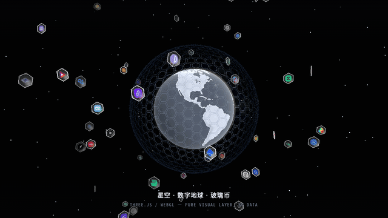
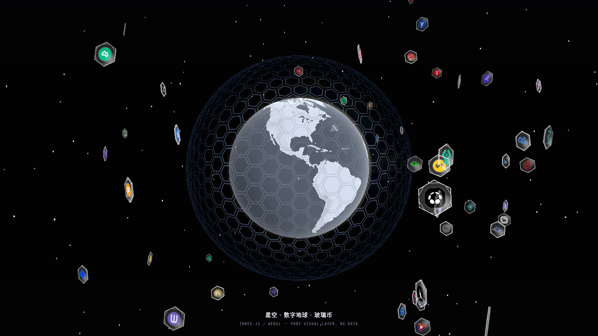

# crypto-globe-ui

自托管的加密风 **3D 视觉层**:程序化星空 + 数字地球 + 六边形玻璃币球。

> A drop-in, self-hosted WebGL visual layer: **procedural starfield + a digital Earth wrapped in a hexagonal glass-coin sphere.**
> Ships with a **free public market feed** (no API key) and stays fully decoupled — plug in your own feed anytime.

**▶ Live demo: https://996688P.github.io/crypto-globe-ui/**





---

## 这是什么

从一套私有交易终端的前端里抽离出来的**纯装饰层**:

- 🌌 **程序化星空** — 数字星幕天球 + 分层视差星点(逐星缓呼吸)
- 🌍 **数字地球** — 冷灰玻璃陆地 / 冰川海洋着色器 + 大气辉光 + 云层
- 💠 **六边形玻璃币球** — Goldberg 六边形球几何(942 枚玻璃币),币面取自静态图集
- 🪐 **环绕小行星玻璃币** — 58 枚币在自己随机的 3D 轨道平面围绕地球飘(四面八方),
  真 3D 遮挡 + 空气透视;支持**指针交互:点到/碰到即被弹开飘走**,随后自然飘回轨道
- 🌠 **环绕粒子层** — 币种节点在椭圆轨道环绕地球飘 + 邻近节点连线(区块链观感)
  + 区块脉冲(内环跑点 + 扩散圈);独立 canvas, 页面隐藏即停止 rAF, 尊重 `prefers-reduced-motion`
- 🫧 **沉浸呼吸** — 整页环境光 26s 明暗呼吸 + 地球外围能量环 7.5s 缩放呼吸
  (纯 CSS, 只动 `transform`/`opacity` → 走 GPU 合成, 不触发布局重排)
- ✨ **辉光后处理** — UnrealBloom 光晕管线(fail-open)
- 🎬 **载入页特效** — 无品牌的全屏启动遮罩(轨道环 + 玻璃内核 + 扫描条),
  地球就绪/窗口 load 时淡出并移除 DOM

只保留"看得见的好看",不含任何业务、行情、账户、接口逻辑。

> **沉浸感从哪来**:载入页特效 + 三层持续呼吸 —— ① 环绕粒子层(币种节点/连线/脉冲);
> ② 地球外围能量环 7.5s 缩放呼吸;③ 整页环境光 26s 明暗呼吸。
> 全部通过 `prefers-reduced-motion` 提供静态降级, 且只走 GPU 合成层。

## 技术栈

- **Three.js**(`vendor/three.min.js`)+ 后处理 pass 集
- 原生 ES5 风格 JS,无构建步骤 — 双击 `index.html` 即可

## 运行

```bash
# 任选其一
python3 -m http.server 8099
# 然后打开 http://localhost:8099/
```

> 需要浏览器支持 WebGL。无 WebGL 时会显示静态兜底环(不至于空白)。

> ⚠️ **子路径部署注意**:所有资源均以**相对路径**引用(`vendor/...` / `assets/...`)。
> 若部署到子目录(如 GitHub Pages 的 `/<repo>/`),请直接从该目录提供服务,
> 或用 `<base href>` 指定前缀 —— **不要**在代码里写 `/vendor/...` 这类根绝对路径,
> 否则子路径下会 404(贴图全丢 → 只剩白球)。

## 目录

```
index.html              全屏页面(星空 + 地球 + 币球 + 小行星 + 载入遮罩)
assets/globe.js         视觉核心(WebGL 场景)
assets/asteroid.js      环绕小行星玻璃币层(逐帧由 globe.js tick 驱动)
assets/coins_hi/        58 枚高清币 logo 贴图(512px,小行星币面)
assets/particles.js     环绕粒子层(币种节点 + 邻近连线 + 区块脉冲, 纯装饰 canvas)
assets/postfx.js        辉光后处理(包装 WebGLRenderer)
assets/market-feed.js   免费公开行情接入(CoinGecko + Binance, 无密钥, fail-open)
assets/globe.css        视觉样式(含载入遮罩 #cgBoot + 沉浸呼吸层)
vendor/                 Three.js + postproc + 贴图/几何数据
vendor/coin_atlas_hi.*  942 枚币图集 + 索引(地球六边形砖的币面)
```

> 小行星层的币面为**静态贴图**(`assets/coins_hi/*.png` ⊕ `vendor/coin_atlas_hi.*`),
> 不依赖任何行情接口;币种色环自带。想改成按涨跌着色,自行给符号绑数据即可。

## 数据接入(免费公开行情, 默认开启)

`assets/market-feed.js` 自带**无需任何 API key** 的公开行情接入, 让球面币按 24h 涨跌着色 / 按成交额定大小:

| 数据源 | 用途 | 备注 |
| --- | --- | --- |
| [Binance](https://api.binance.com/api/v3/ticker/24hr) | 现货 24h 涨跌幅 + 成交额 | 覆盖最广, 推荐 |
| [CoinGecko](https://www.coingecko.com/en/api) | 市值前 250 币, 补全 | 免费档有限频(429 时自动跳过) |

- 浏览器端直接 `fetch`(两源均开放 CORS), **零密钥**、零后端。
- 每 60s 自动刷新;取不到数据时静默降级 → 球面只出 logo(不伪造 0.00%)。
- 币种符号需存在于 `vendor/coin_atlas_hi.json`;不在图集内的自动忽略(覆盖约 60% 图集币种)。

### 换成你自己的数据

改写 `assets/market-feed.js` 的取数逻辑即可,或在页面里直接喂视觉层钩子:

```js
// 六边形玻璃币球(主视觉)
window.__cgHexMkt({ universe: [ { sym:"BTC", chg_pct: 1.2, vol: 1e9 }, /* ... */ ] });
// 领土层(若启用)
window.__cgTerrMkt([ { sym:"ETH", chg_pct: -0.8, vol: 5e8 } ]);
```

## 素材与许可

- 代码:**MIT**(见 `LICENSE`)
- 地球贴图(`earth_*.webp`):源自 **NASA Visible Earth**(公有领域)
- 币图集 / 球面几何(`coin_atlas_hi.webp` / `hexsphere.json` / `coin_globe.json` / `territory.json`):
  由公开的代币符号集合派生,仅供演示 — 商业使用前请替换为你自己的素材。

---

*Ported and de-coupled from a private trading terminal. All identifying names, endpoints, data feeds and business logic were removed.*
